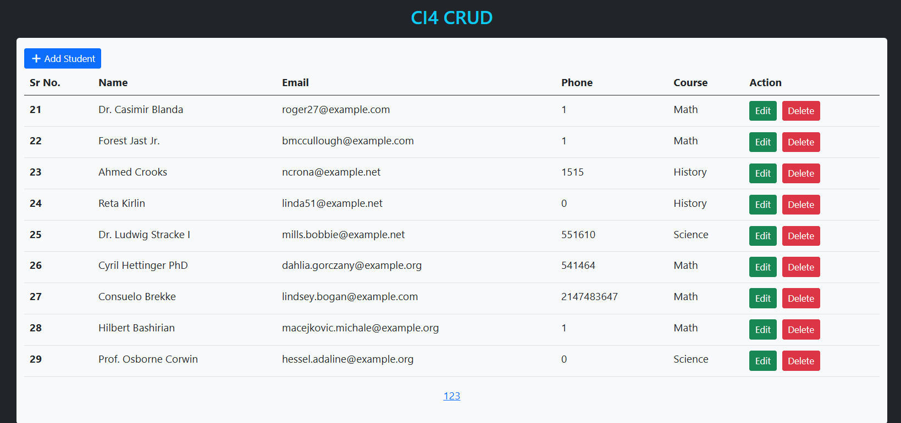
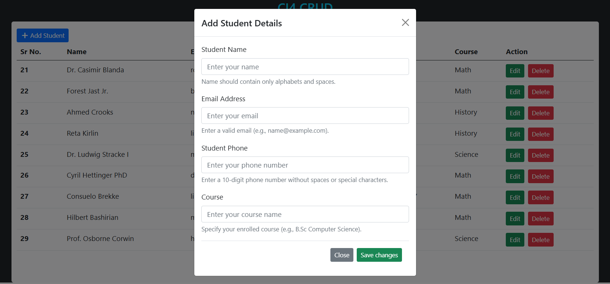
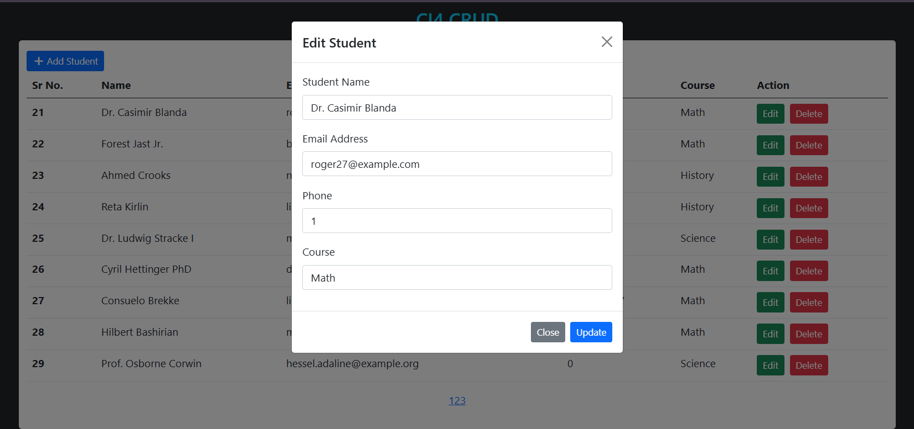
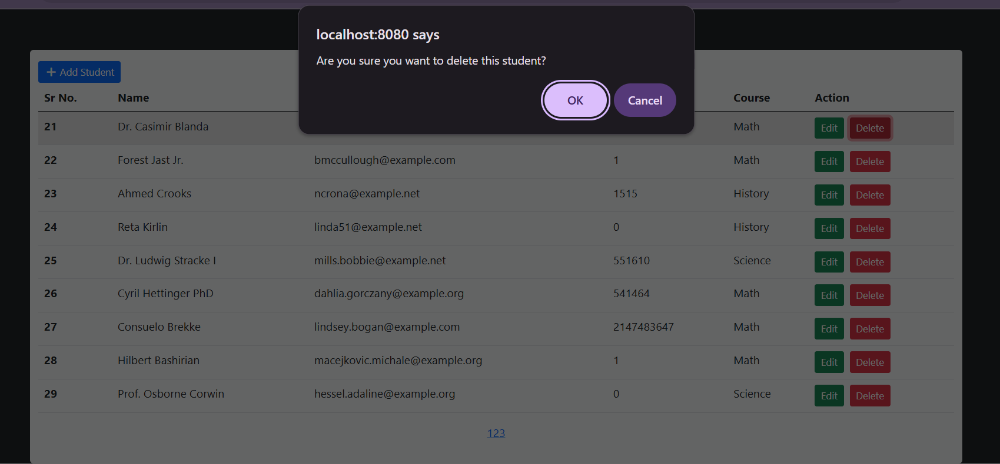

# CI4 CRUD 🎓

A **CodeIgniter 4** project that implements a **CRUD (Create, Read, Update, Delete)** system for managing students.  
Each student record contains:

- Name
- Email
- Phone
- Course

The project demonstrates CodeIgniter 4 basics with database seeding, AJAX, and simple CRUD operations.

---

## 🚀 Features

- Add new student
- View student list (with pagination)
- Update existing student
- Delete student
- Seeder for generating dummy students
- AJAX form submission with toastr notifications
- CodeIgniter 4.6.3 framework

---

## 📸 Screenshots

(Sample screenshots are included in the `screenshots/` folder.)


### Student List Page


### Add Student Form


### Edit Student


### Delete Confirmation



---

## 🛠️ Requirements

- PHP **8.1+**
- Composer
- MySQL / MariaDB
- CodeIgniter 4.6.3

Make sure PHP extensions are enabled:

- intl
- mbstring
- json
- mysqlnd
- curl

---

## ⚙️ Installation & Setup

1. **Clone the repository**

   ```bash
   git clone https://github.com/NaimishDwivedi/ci4_crud.git
   cd ci4_crud
   ```

2. **Install dependencies**

   ```bash
   composer install
   ```

  - Open the project in any code editor.:
3. **Environment setup**

   - Copy `.env.example` to `.env`

   ```bash
   cp env .env
   ```

   - Update your database credentials in `.env`:

   ```dotenv
   database.default.hostname = localhost
   database.default.database = ci4_crud
   database.default.username = root
   database.default.password =
   database.default.DBDriver = MySQLi
   ```

4. **Create database**

   ```bash
   mysql -u root -p -e "CREATE DATABASE ci4_crud;"
   ```

5. **Run migrations**

   ```bash
   php spark migrate
   ```

6. **Run seeders (to insert 10 dummy students ,since data will be inserted via seeder, it will voilate the validation rule)**

   ```bash
   php spark db:seed StudentSeeder
   ```

7. **Start development server**

   ```bash
   php spark serve
   ```

8. Open in browser:
   ```
   http://localhost:8080
   ```

---

## 🧑‍💻 Useful Commands

- Run migrations:

  ```bash
  php spark migrate
  ```

- Rollback migrations:

  ```bash
  php spark migrate:rollback
  ```

- Seed database:

  ```bash
  php spark db:seed StudentSeeder
  ```

- Clear cache:

  ```bash
  php spark cache:clear
  ```

- Run development server:
  ```bash
  php spark serve
  ```

---

## 📂 Project Structure

```
ci4_crud /
│── app/
│   ├── Controllers/       # Home controller
│   ├── Models/            # Student model
│   ├── Views/             # CRUD views
│   └── Database/
│       └── Seeds/         # StudentSeeder.php
│
│── public/                # index.php entry
│── writable/
│── .env
│── composer.json
│── README.md
```

---

## ✨ Author

Developed as part of **CI4 CRUD Practise**.  
CRUD Example in **CodeIgniter 4** with Student Management.

---

## 📜 License

This project is open-source and free to use for learning purposes.
